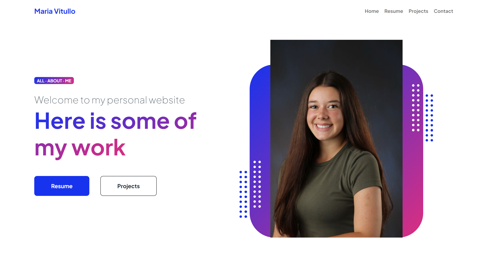

# 📁 Personal Website – Sprint 1 Backlog

Welcome to the README for my **personal website project**. This README.md focuses on planning, setup, and preparing the infrastructure and initial codebase for my site. This site will showcase who I am, my experience, and my professional goals, as well as link my Linked in and GIthub

---

## Preview

---

##  Project Overview

This project was designed as a **static website** that reflects both technical ability and personal branding. It was developed with a strong focus on accessibility, responsiveness, and professional polish. Below is a breakdown of the key features and implementation steps.

---

##  Key Accomplishments

### 🔹 Template Customization
- Selected a free **Bootstrap 5** template from Start Bootstrap ([link](https://startbootstrap.github.io/startbootstrap-personal/index.html)) as a foundation.
- Modified HTML structure and content to reflect my own:
  - Added **About Me**, **Resume**, **Projects**, and **Contact** sections.
  - Removed irrelevant scripts and unused content for cleaner performance.
  - Customized styling and layout to match my aesthetic and branding needs.

### 🔹 Functional Enhancements
- Embedded **LinkedIn** and **GitHub** profile buttons for networking and visibility.
- Linked a **PDF version of my resume** for easy download by recruiters and visitors.
- Added **favicon icons** for a polished browser experience.

### 🔹 Deployment & Domain Setup
- Hosted the site on **Azure Static Web Apps**.
- Successfully connected the site to my **custom domain** purchased via Namecheap.
- Verified DNS records and SSL configuration to ensure secure, live access.

### 🔹 Analytics & Policies
- Integrated **Google Analytics** to track visitor traffic and engagement behavior.
- Created and linked:
  - **Privacy Policy**
  - **Cookie Policy**
  - **Terms and Conditions**  
  These were written and implemented to ensure transparency and compliance.

---

## ✅ Accessibility & Testing

- Performed color contrast adjustments to meet **WCAG 2.1 AA** standards.
- Used **WAVE** and **Lighthouse** to identify and resolve accessibility errors.
- Validated HTML and CSS with [W3C](https://validator.w3.org/) to ensure semantic structure and code quality.
- Ensured keyboard navigation and screen reader compatibility with proper ARIA labels.

---

## 🗂 Repository Setup

- Created GitHub repo: `mvitullo-final-project`
- Added `.gitignore` to exclude unnecessary files (IDE configs, system files).
- Maintained organized project structure with folders for:
  - `/assets`
  - `/pages`
  - `/styles`
  - `/docs` (for resume and legal docs)

---

##  Next Steps (Sprint 2 Ideas)

- Add a **contact form** using a form handling service like Formspree or Netlify Forms.
- Incorporate **project filtering or interactivity** using JavaScript.
- Explore deployment pipelines for automated updates via GitHub Actions.

---

Thanks for checking out my project!

